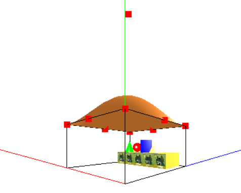
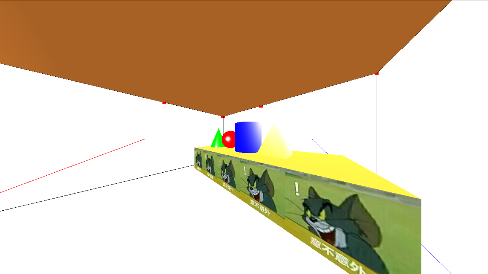
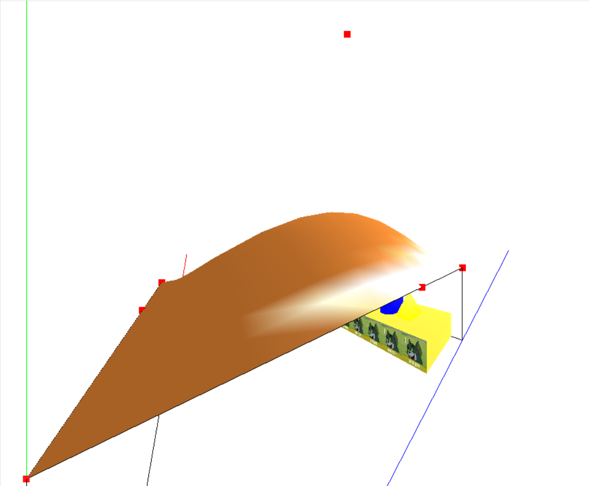

# simple-3D-room

## 题目

试设计一个室内三维环境, 并利用OPEN GL展示它的三维效果。要求：
1. 包含基本的实体元素：球、多面体、锥体、柱体、曲面等
2. 有全局光照效果和纹理功能
3. 程序具有交互功能

## 环境

- IDE - VS2017
- 语言 - C++
- 三方库
  - GLUT(freeglut3.0.0)
  - SOIL(Simple OpenGL Image Library)

## 效果

全局效果，一个空心立方体作为房间轮廓，房顶为曲面。为了方便调试，画出了坐标轴和房顶的贝塞尔曲面控制点。



房间内有一个桌子，桌子的正面使用纹理填充，桌子上放置一个圆锥、一个球、一个圆柱和一个棱柱。可以看到所有物体的反光效果



屋顶为贝塞尔曲面，可以看到明显的光照效果



交互：使用第一人称视角，键盘WASD提供前进、后退、左平移、右平移的操作，QE提供向左旋转和向右旋转的操作。

## 实现

### 程序结构

main函数内容：

- 初始化环境与应用
- 注册事件（重绘事件、改变窗口大小事件、按键交互事件）
- OpenGL自动机初始化
- 启动事件循环

### 构造实体

房间轮廓使用glutWireCube函数构造

桌子上的球体和圆锥分别使用glutSolidSphere和glutSolidCone函数构造

其他实体均使用OpenGL构造多边形实现。以构造圆柱为例，代码逻辑如下：

```cpp
// build a cylinder, use (0, 0, 0) as center, Y as axis
void buildCylinder(double radius, double height, int slices, bool line)
{
	// calculate x and z
	std::vector<double> x;
	std::vector<double> z;
	for (int i = 0; i < slices; ++i)
	{
		x.push_back(radius * cos(radians(360 / slices * i)));
		z.push_back(radius * sin(radians(360 / slices * i)));
	}
	// link head and tail
	x.push_back(x[0]);
	z.push_back(z[0]);

	// build underside
	if (line)
		glBegin(GL_LINE_LOOP);
	else
		glBegin(GL_POLYGON);
	for (int i = 0; i < slices; ++i)
	{
		glVertex3d(x[i], height / 2, z[i]);
	}
	glEnd();
	if (line)
		glBegin(GL_LINE_LOOP);
	else
		glBegin(GL_POLYGON);
	for (int i = slices - 1; i >= 0; --i)
	{
		glVertex3d(x[i], -height / 2, z[i]);
	}
	glEnd();

	//build flank
	for (int i = 0; i < slices; ++i)
	{
		if (line)
			glBegin(GL_LINE_LOOP);
		else
			glBegin(GL_POLYGON);
		glVertex3d(x[i], -height / 2, z[i]);
		glVertex3d(x[i + 1], -height / 2, z[i + 1]);
		glVertex3d(x[i + 1], height / 2, z[i + 1]);
		glVertex3d(x[i], height / 2, z[i]);
		glEnd();
	}
}
```

### 启动光照

设置光照参数

```cpp
// Light values and coordinates
GLfloat globalAmbient[] = {0.2f, 0.2f, 0.2f, 1.0f}; // RGBA
GLfloat ambient[] = {1.0f, 1.0f, 1.0f, 1.0f};
GLfloat diffuse[] = {1.0f, 1.0f, 1.0f, 1.0f};
GLfloat specular[] = {1.0f, 1.0f, 1.0f, 1.0f};
GLfloat specref[] = {3.0f, 3.0f, 3.0f, 3.0f};
// light position (x, y, z, w)
// w=0 means the light is a directional source, ignore its position
// otherwise take its position into consideration
GLfloat light0Position[] = {3.0f, 2.0f, 1.0f, 1.0f};
```

在OpenGL自动机初始化函数setupRC中启动光照，设置全局泛光和一个固定光源，设置物体默认纹理为颜色

```cpp
// Enable lighting
glEnable(GL_LIGHTING);
// setup global env light
glLightModelfv(GL_LIGHT_MODEL_AMBIENT, globalAmbient);
// set view point to local view point
glLightModeli(GL_LIGHT_MODEL_LOCAL_VIEWER, GL_TRUE);
// setup double side light
glLightModeli(GL_LIGHT_MODEL_TWO_SIDE, GL_TRUE);
// Setup and enable light 0
glLightfv(GL_LIGHT0, GL_AMBIENT, ambient);
glLightfv(GL_LIGHT0, GL_DIFFUSE, diffuse);
glLightfv(GL_LIGHT0, GL_SPECULAR, specular);
glEnable(GL_LIGHT0);
// setup shade model
glShadeModel(GL_SMOOTH);

// Set Material properties to follow glColor values
glColorMaterial(GL_FRONT_AND_BACK, GL_AMBIENT_AND_DIFFUSE);

// Enable meterial
glEnable(GL_COLOR_MATERIAL);
// All materials hereafter have full specular reflectivity
// with a high shine
glMaterialfv(GL_FRONT_AND_BACK, GL_SPECULAR, specref);
glMateriali(GL_FRONT_AND_BACK, GL_SHININESS, 50);
```

然后在render中设置光源位置（叠加了model view matrix的位置）

```cpp
glLightfv(GL_LIGHT0, GL_POSITION, light0Position);
```

### 应用纹理

在setupRC函数中启动纹理，使用SOIL库载入jpeg格式纹理图片并载入OpenGL中

```cpp
// enable texture
glEnable(GL_TEXTURE_2D);

// init texture
glGenTextures(1, &tex); // generate one texture id to &tex
glBindTexture(GL_TEXTURE_2D, tex); // operations to 2d texture after this will apply to tex
glTexParameteri(GL_TEXTURE_2D, GL_TEXTURE_WRAP_S, GL_REPEAT); // repeat texture if space is wider than texture
glTexParameteri(GL_TEXTURE_2D, GL_TEXTURE_WRAP_T, GL_REPEAT); // repeat texture if space is higher than texture
glTexParameteri(GL_TEXTURE_2D, GL_TEXTURE_MIN_FILTER, GL_LINEAR);
glTexParameteri(GL_TEXTURE_2D, GL_TEXTURE_MAG_FILTER, GL_LINEAR);
glTexEnvf(GL_TEXTURE_ENV, GL_TEXTURE_ENV_MODE, GL_REPLACE);
int width, height;
unsigned char *img = SOIL_load_image("me.jpg", &width, &height, 0, SOIL_LOAD_RGB); // load image to memory
// bind img to current 2d texture(aka: tex)
glTexImage2D(GL_TEXTURE_2D, 0, GL_RGB, width, height, 0, GL_RGB, GL_UNSIGNED_BYTE, img);
SOIL_free_image_data(img); // free img memory, texture will still be stored in memory
glBindTexture(GL_TEXTURE_2D, 0); // end operation about texture
```

在应用纹理时，使用glBindTexture启动指定二维纹理即可，比如构造桌子正面的纹理的代码逻辑如下：

```cpp
// draw the front face with texture
glBindTexture(GL_TEXTURE_2D, tex); // enable texture
glBegin(GL_POLYGON);
glTexCoord2d(0, 0);
glVertex3d(room.table.centerX + room.table.lenX / 2,
				 room.table.centerY + room.table.lenY / 2,
				 room.table.centerZ - room.table.lenZ / 2); // left top
glTexCoord2d(room.table.lenX, 0);
glVertex3d(room.table.centerX - room.table.lenX / 2,
				 room.table.centerY + room.table.lenY / 2,
				 room.table.centerZ - room.table.lenZ / 2); // right top
glTexCoord2d(room.table.lenX, room.table.lenY);
glVertex3d(room.table.centerX - room.table.lenX / 2,
				 room.table.centerY - room.table.lenY / 2,
				 room.table.centerZ - room.table.lenZ / 2); // right bottom
glTexCoord2d(0, room.table.lenY);
glVertex3d(room.table.centerX + room.table.lenX / 2,
				 room.table.centerY - room.table.lenY / 2,
				 room.table.centerZ - room.table.lenZ / 2); // left bottom
glEnd();
glBindTexture(GL_TEXTURE_2D, 0); // disable texture
```

即，在构造多边形的时候，除了定义顶点vertex，还要定义对应的纹理坐标texture coordinates

使用完毕后要使用glBingTexture把纹理清空，防止其他对象也应用此纹理。

### 实现交互

注册能够识别ascii码的回调函数keyPressEvent，根据用户按键修改player结构体的位置属性和角度属性，然后在render函数中使用gluLookAt函数指定摄像机位置。

需要注意的是gluLookAt是通过修改model view matrix实现的，所以在render函数中需要在其他物体构建之前使用gluLookAt函数（包括光源）。